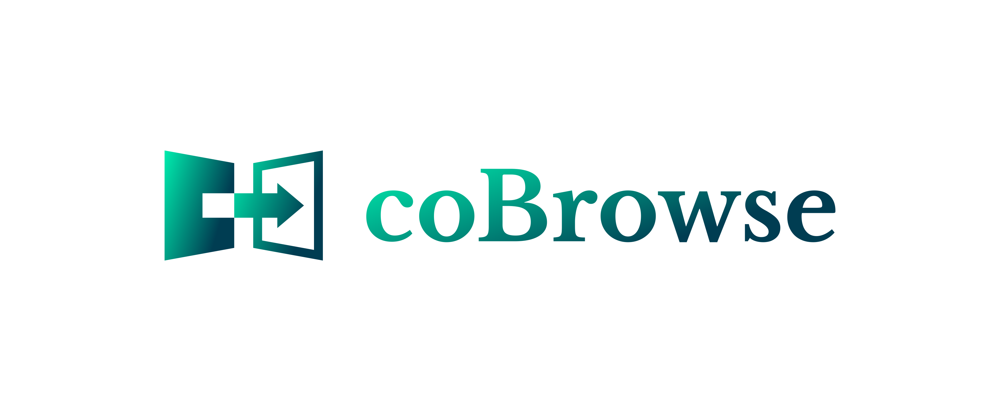

# Logotyp cobrowse.pl
+ [Landing page: www.cobrowse.pl](https://www.cobrowse.pl/)
+ [Dokumentacja](https://docs.cobrowse.pl/)
+ [Logo.cobrowse.pl](https://logo.cobrowse.pl/)

# Font

        Font in use <a target="_blank" href="https://fonts.google.com/specimen/Libre+Baskerville">LibreBaskerville-Bold</a> designed by
        <a target="_blank" href="https://twitter.com/pabloimpallari">Impallari Type</a>
        and licensed under
        <a target="_blank" href="http://scripts.sil.org/cms/scripts/page.php?site_id=nrsi&amp;id=OFL_web">Open Font License.</a>
          Icon Designed by
          <a target="_blank" href="https://thenounproject.com/AndyGigante">Andy Gigante</a>
          
## Font
  
    #00EDAE, #003D52

## Background

    transparent

## Icon
     
    #00EDAE, #003D52
    
    
## logo

## 1

## 2

